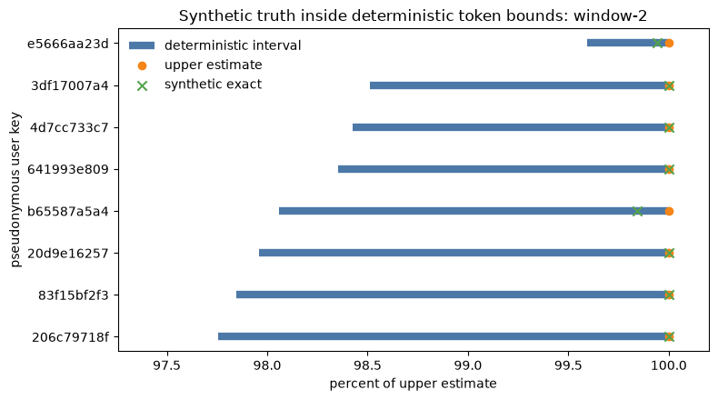

# llm-sketchkit

[](https://github.com/llm-measurement/llm-sketchkit/actions/workflows/ci.yml)

`llm-sketchkit` provides continuous, bounded answers about high-cardinality agent
traffic without exporting or indexing every underlying value. It is a small Go and
Python library with matching semantics for text canonicalization, privacy-preserving
keyed hashes, mergeable sketches, and a deterministic protobuf wire format.

It provides bounded measurement primitives for AI agent observability pipelines,
especially when exporting and indexing every identity or event would be expensive,
slow to query, or inappropriate to retain.

Raw prompts and identifiers do not need to enter sketch state. Producers can
summarize locally and merge compatible sketches across processes or languages.



Actual output from the [Go-to-Python notebook](examples/go-to-python/README.md).
Go produces the summaries; Python reads the same wire bytes, merges service shards,
and plots the results. The green marks are known synthetic counts used to check the
bounds, not information that a production sketch recovers. The horizontal axis
normalizes each interval to its own upper estimate; it does not show share of total
token volume. [Watch the 90-second walkthrough](docs/media/README.md).

## When This Fits

Use `llm-sketchkit` inside telemetry producers and processing components when
exporting and indexing every key would create uncontrolled cardinality, make
operational queries slow or unpredictable, or retain values that should not enter
aggregate state.

Agent fleets and multi-agent systems can produce more identities and events than
an observability backend should continuously index. The library provides bounded,
mergeable summaries across workers and windows.

Questions it can help answer include:

- **How many distinct prompts, users, sessions, tools, or documents are active
  without keeping one counter per value?** HLL++ provides a bounded estimate.
- **Your token budget is climbing and FinOps wants to know which configured
  identities account for the reported volume. How certain is the answer?** Weighted
  frequent-items identifies token-heavy or request-heavy keys with deterministic
  lower and upper bounds.
- **Have we already observed this request or document without maintaining an exact
  set of every value?** Bloom filters provide bounded approximate membership checks.
- **Did the prompt, tool, or retrieval-document population change materially after
  a deployment or model change?** MinHash compares large sets using bounded
  similarity signatures.
- **Can Go services summarize locally while Python analysis jobs read and merge the
  same state?** Shared profiles, fixtures, and wire semantics keep the two
  implementations compatible.

For investigations described as "tokenmaxxing" (also written "token-maxing"),
reported token counts can be used as weights in the frequent-items sketch to identify
which keyed values account for the most token volume. The library measures
concentration; it does not infer task value, enforce budgets, or stop agent loops.
See [Token-Volume Heavy Hitters](#token-volume-heavy-hitters) for a runnable example.

Inputs can be canonicalized and keyed before entering sketch state. This keeps
raw values out of the sketch, but the resulting hashes remain pseudonymous and
linkable while the same secret is in use.

This is a sketch library, not a trace collector, sampling processor, storage
backend, dashboard, or differential-privacy system. The [FAQ](https://github.com/llm-measurement/llm-sketchkit/blob/main/docs/FAQ.md)
answers common questions about fit, operational bounds, accuracy, and
interoperability.

## Choosing An Integration

| Your pipeline | Use | Why |
|---|---|---|
| GenAI spans already flow through an OpenTelemetry Collector | [OpenTelemetry Collector connector](https://github.com/llm-measurement/otelcol-genai-sketches) | It applies keyed hashing, bounded windows, cardinality controls, and trace-to-metrics conversion at the collector boundary. |
| A custom Go or Python streaming service processes events | `llm-sketchkit` directly | Update sketches inside each bounded window, then serialize or merge compatible summaries. |
| A batch or warehouse job reads stored events | `llm-sketchkit` directly | Build bounded summaries per partition or window and merge them before publishing results. |
| You only need to store or visualize finished metrics | Your existing backend integration | The library is not an exporter; ClickHouse, Datadog, Prometheus, and similar systems normally receive the aggregated results. |

Use the collector path when the source spans already flow through OpenTelemetry. Use
the library when you own the event-processing code or need matching Go and Python
summaries outside an OpenTelemetry pipeline. In either case, compatible producers
must agree on profile, hash domain, hash algorithm, secret, and window boundaries.

## Included Sketches

| Component | Use it for | Important property |
|---|---|---|
| HLL++ | Approximate distinct counts | Bounded, mergeable state |
| Weighted frequent-items | Heavy hitters and top items | Deterministic lower and upper bounds |
| Bloom filter | Set membership | No false negatives; configurable false-positive rate |
| MinHash | Approximate Jaccard similarity | Bounded, mergeable signatures |

The Go and Python implementations share the same profiles, hash domains, test
vectors, and serialized representation.

## Evidence At A Glance

Measurements use deterministic workloads and report the least favorable of five
Linux benchmark runs where applicable.

- HMAC-SHA256-64 sustained at least **1.65 million 64-byte inputs/s/core** and
  **850,340 1 KiB inputs/s/core** on an Intel Xeon Platinum 8573C with Go 1.26.5.
- HLL++ and weighted frequent-items updates took at most **10.58 ns/op** and
  **145.6 ns/op**, respectively, with **0 allocations/op** in the measured paths.
- The HLL++ `small` profile's maximum observed relative error was **2.3301%**
  across the characterization grid, within its **2.4375%** enforced bound.
- Bloom profile false-positive rates were at or below their configured targets
  in the measured trials, with zero false negatives among inserted hashes.
- MinHash mean absolute error fell from **0.02845** at `k=128` to **0.02009** at
  `k=256`, closely following the expected inverse-square-root relationship.
- Both weighted frequent-items oracle workloads retained **100% true top-20
  recall** and valid no-false-positive query results in both implementations.

See the [visual scorecard](https://github.com/llm-measurement/llm-sketchkit/blob/main/reports/scorecard.md),
[raw measurement records](https://github.com/llm-measurement/llm-sketchkit/blob/main/reports/README.md),
and [general-purpose library comparison](https://github.com/llm-measurement/llm-sketchkit/blob/main/docs/DATASKETCHES.md)
for methods, limitations, and reproduction commands.

## Requirements

- Go 1.25 or 1.26, with the latest security patch for that release line
- Python 3.11, 3.12, 3.13, or 3.14

## Install

### Python

```sh
python -m pip install llm-sketchkit
```

Generate a process secret:

```sh
export LLM_SKETCHKIT_SECRET="$(python -c 'import secrets; print(secrets.token_hex(32))')"
```

Run a distinct-count example:

```sh
python - <<'PY'
from llm_sketchkit import PROMPT_V1, canonicalize_text_v1, hash64, hllpp
from llm_sketchkit import secret_from_env

secret = secret_from_env("LLM_SKETCHKIT_SECRET")
sketch = hllpp.new("small", PROMPT_V1)

canonical = canonicalize_text_v1("  cafe\u0301\r\n")
sketch.add_hash(hash64(secret, PROMPT_V1, canonical))

print(f"estimated distinct prompts: {sketch.estimate():.0f}")
PY
```

Expected output:

```text
estimated distinct prompts: 1
```

### Go

From an existing Go module, add the package used by the equivalent example:

```sh
go get github.com/llm-measurement/llm-sketchkit/go/sketchkit/hllpp@latest
```

Use the same `LLM_SKETCHKIT_SECRET` and run:

```go
package main

import (
	"fmt"
	"log"

	"github.com/llm-measurement/llm-sketchkit/go/sketchkit/canon"
	sketchhash "github.com/llm-measurement/llm-sketchkit/go/sketchkit/hash"
	"github.com/llm-measurement/llm-sketchkit/go/sketchkit/hllpp"
)

func main() {
	secret, err := sketchhash.SecretFromEnv("LLM_SKETCHKIT_SECRET")
	if err != nil {
		log.Fatal(err)
	}

	sketch, err := hllpp.New(
		hllpp.ProfileSmall,
		sketchhash.PromptV1,
		sketchhash.HMACSHA25664,
	)
	if err != nil {
		log.Fatal(err)
	}

	canonical, err := canon.CanonicalizeString(canon.TextV1, "  cafe\u0301\r\n")
	if err != nil {
		log.Fatal(err)
	}
	digest, err := sketchhash.Hash64(secret, sketchhash.PromptV1, canonical)
	if err != nil {
		log.Fatal(err)
	}

	sketch.AddHash(digest)
	fmt.Printf("estimated distinct prompts: %.0f\n", sketch.Estimate())
}
```

## Go To Python Notebook

The [runnable notebook](https://github.com/llm-measurement/llm-sketchkit/blob/main/examples/go-to-python/go-to-python.ipynb) produces
per-service HLL++ and weighted frequent-items summaries in Go, then loads,
validates, merges, and plots them in Python. It checks that serialization round trips
return the same bytes,
explicit merge rejection for incompatible profiles, distinct-count estimates,
and deterministic bounds around token-heavy pseudonymous keys.

The tutorial uses an exact synthetic side channel only to check its estimates.
Raw synthetic identifiers do not enter the emitted files. See the
[example guide](https://github.com/llm-measurement/llm-sketchkit/blob/main/examples/go-to-python/README.md)
for setup and security details.

## Token-Volume Heavy Hitters

If by "tokenmaxxing" (also written "token-maxing") you mean unexpected or runaway
token consumption, use a bounded frequent-items sketch to find where reported volume
is concentrated. Hash the value being investigated, such as a prompt template, tool,
or user, with the registered domain for that entity class, and use the reported token
count as its weight. This example measures prompt templates with `prompt:v1`:

```python
from llm_sketchkit import PROMPT_V1, canonicalize_text_v1, frequentitems
from llm_sketchkit import hash64, secret_from_env

secret = secret_from_env("LLM_SKETCHKIT_SECRET")
sketch = frequentitems.Sketch("small", PROMPT_V1)

events = [
    ("support/refund", 1_240),
    ("research/synthesis", 8_900),
    ("support/refund", 980),
    ("coding/review", 3_600),
]

for prompt_template, reported_tokens in events:
    canonical = canonicalize_text_v1(prompt_template)
    digest = hash64(secret, PROMPT_V1, canonical)
    sketch.add_hash(digest, reported_tokens)

for item in sketch.frequent_items(frequentitems.NO_FALSE_NEGATIVES)[:10]:
    print(
        f"{item.hash:016x} estimate={item.estimate} "
        f"bounds=[{item.lower_bound}, {item.upper_bound}]"
    )
```

The sketch retains at most the selected profile's bounded map size. Returned hashes
are pseudonymous and remain linkable while the same secret and domain are in use.
The estimate is not a billing total; use the lower and upper bounds when deciding
whether an item is meaningfully heavy.

Do not substitute guessed weights when token usage is missing. Count missing usage
separately so operators know how complete the reported totals are. For an OTLP
pipeline with ready-made metrics, bounded slices, missing-usage accounting, and
token-weighted top-k snapshots, use
[`otelcol-genai-sketches`](https://github.com/llm-measurement/otelcol-genai-sketches).

## Merge Sketches

Sketches merge only when their kind, profile, hash domain, hash algorithm, and
shape metadata match. A mismatch is an error rather than an implicit conversion.

```python
left = hllpp.new("small", PROMPT_V1)
right = hllpp.new("small", PROMPT_V1)

left.add_hash(hash64(secret, PROMPT_V1, canonicalize_text_v1("alpha")))
right.add_hash(hash64(secret, PROMPT_V1, canonicalize_text_v1("beta")))

left.merge(right)
print(f"merged distinct prompts: {left.estimate():.0f}")
```

## Security And Privacy

- Hash inputs with a registered domain and a high-entropy secret before adding
  them to a sketch. The built-in secret loaders require at least 16 bytes and
  reject known placeholder values.
- Keyed hashes are pseudonymous, not anonymous. Anyone with the secret can test
  candidate values, and repeated hashes remain linkable while the same secret
  and domain are in use.
- Never log, serialize, or commit the hash secret. Rotate it when the trust
  boundary changes; rotation intentionally breaks comparison with older state.
- Bound raw input size before canonicalization. Canonicalization operates on
  in-memory text and intentionally leaves application-specific limits to callers.
- Sketches reveal bounded aggregate information and may reveal membership or
  recurrence. They do not provide differential privacy.
- Treat serialized sketches as untrusted input at process boundaries. The parse
  APIs cap input size and reject invalid profiles, domains, shapes, counters, and
  register values.

See [SECURITY.md](https://github.com/llm-measurement/llm-sketchkit/blob/main/SECURITY.md)
for private vulnerability reporting and
[Operational Contracts](https://github.com/llm-measurement/llm-sketchkit/blob/main/docs/OPERATIONS.md)
for concurrency, ownership, resource, upgrade, and support guarantees.
The [API reference](https://github.com/llm-measurement/llm-sketchkit/blob/main/docs/API.md)
lists which failed mutations leave a sketch unchanged.

## Development

```sh
git clone https://github.com/llm-measurement/llm-sketchkit.git
cd llm-sketchkit
python -m venv .venv
source .venv/bin/activate
python -m pip install --upgrade pip==26.2.1 setuptools==83.0.0
python -m pip install -e '.[dev]'
```

## Wire Compatibility

Deterministic protobuf encoding is part of the compatibility surface. Go and
Python are checked against the same canonicalization, hashing, sketch, and
cross-language merge fixtures in
[`vectors/`](https://github.com/llm-measurement/llm-sketchkit/tree/main/vectors/).
Released state is also pinned by digest in
[`vectors/compat/`](https://github.com/llm-measurement/llm-sketchkit/tree/main/vectors/compat/)
and loaded by both implementations on every test run.

Run all local checks:

```sh
go test ./... -race
python -m pytest -q
ruff check .
mypy --strict
```

The optional Apache DataSketches comparison checks weighted frequent-items
query behavior against an independent implementation:

```sh
python -m pip install -e '.[oracle]'
python scripts/datasketches_oracle.py --check
```

## Reference

- [`spec/`](https://github.com/llm-measurement/llm-sketchkit/tree/main/spec/) defines canonicalization, hashing, profiles, and wire encoding.
- [`vectors/`](https://github.com/llm-measurement/llm-sketchkit/tree/main/vectors/) contains executable conformance fixtures.
- [`reports/`](https://github.com/llm-measurement/llm-sketchkit/tree/main/reports/) contains benchmark, accuracy, and oracle results.
- [`bench/`](https://github.com/llm-measurement/llm-sketchkit/tree/main/bench/) contains the Go benchmark harnesses.
- [`docs/FAQ.md`](https://github.com/llm-measurement/llm-sketchkit/blob/main/docs/FAQ.md) answers common adoption questions.
- [`docs/OPERATIONS.md`](https://github.com/llm-measurement/llm-sketchkit/blob/main/docs/OPERATIONS.md) defines runtime, concurrency, resource, upgrade, and support contracts.
- [`docs/SUPPLY_CHAIN.md`](https://github.com/llm-measurement/llm-sketchkit/blob/main/docs/SUPPLY_CHAIN.md) documents dependency controls, SBOMs, checksums, and PyPI attestation verification.
- [`CHANGELOG.md`](https://github.com/llm-measurement/llm-sketchkit/blob/main/CHANGELOG.md) records release-level changes.

## Status

`llm-sketchkit 0.1.x` is a supported release line. Patch releases preserve the
documented wire formats, named hash domains, and Go and Python APIs exercised by
the checked-in conformance vectors. Additive or incompatible changes to that
surface receive a new minor version and are called out in the changelog before
`1.0`. Supported runtimes, deprecation notice, and security backports follow the
[operational policy](https://github.com/llm-measurement/llm-sketchkit/blob/main/docs/OPERATIONS.md#support-and-deprecation).

## License

Apache-2.0.
