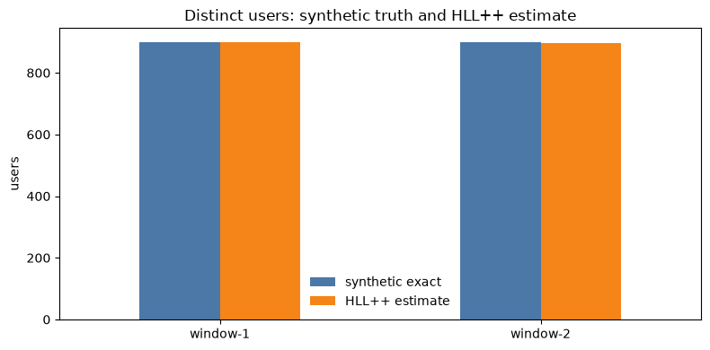
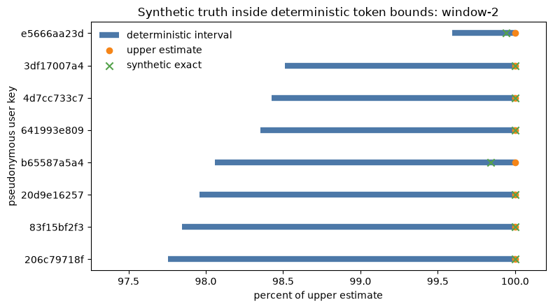

# Go-To-Python Notebook

This example produces mergeable HLL++ and weighted frequent-items summaries in
Go, then loads, validates, merges, and plots them in a Python notebook.

The producer generates two service shards in each of two windows. Raw synthetic
user IDs are canonicalized and keyed-hashed inside the Go process. The emitted
files contain sketch state, a manifest, and bounded synthetic validation
aggregates, with identities represented by keyed hashes.

## See The Result





These plots were produced by executing the notebook on 2026-09-04. Each token
interval is normalized to its own upper estimate to make its width visible; this is
not a ranking by token share. Green crosses are exact synthetic validation values.
Hashes and HLL++ estimates can differ between runs because the demo secret changes.

The [90-second captioned walkthrough](../../docs/media/README.md) shows the same
outputs. The library notebook and collector dashboard are separate workflows.
The connector can export window-scoped summary envelopes containing serialized
sketches; this notebook uses its own producer's manifest and individual sketch
files. See [summary exchange](../summary-exchange/README.md) for envelope inputs.

## Run It

From the repository root:

```sh
python -m venv .venv
source .venv/bin/activate
python -m pip install --upgrade pip
python -m pip install llm-sketchkit pandas matplotlib jupyterlab
jupyter lab examples/go-to-python/go-to-python.ipynb
```

Run the notebook from top to bottom. It invokes the Go producer itself. If
`LLM_SKETCHKIT_SECRET` is unset, the notebook creates an ephemeral secret for
that run without displaying it.

To preserve pseudonymous key comparability across notebook restarts, provide a
deployment secret explicitly:

```sh
export LLM_SKETCHKIT_SECRET="$(python -c 'import secrets; print(secrets.token_hex(32))')"
jupyter lab examples/go-to-python/go-to-python.ipynb
```

Generated files are written under `examples/go-to-python/generated/` and are
ignored by Git.

To regenerate the documentation plots without saving outputs into the source
notebook, install `nbclient` and run:

```sh
python -m pip install nbclient
python examples/go-to-python/render.py
```

This executes every cell, including byte round-trips, incompatible-merge rejection,
and bound checks, then exports only the two PNG plots under `docs/images/`.

## What It Demonstrates

- Go and Python parse the same canonical wire representation.
- Re-serializing an unchanged Go-produced sketch in Python returns the same bytes.
- Incompatible profile merges fail explicitly.
- Compatible service shards merge by window.
- HLL++ distinct estimates can be compared with a documented profile-level
  characterization bound.
- Weighted frequent-items returns deterministic lower and upper bounds for
  token-heavy pseudonymous keys.

The exact counts and token weights in `synthetic-validation.json` check this
synthetic workload. Use independent reference counts when validating your own data.

## Security Boundary

Protect the secret and serialized summaries using the
[security guidance](../../README.md#security-and-privacy). Key rotation changes
comparability, so keep a consistent key for windows you intend to compare.
