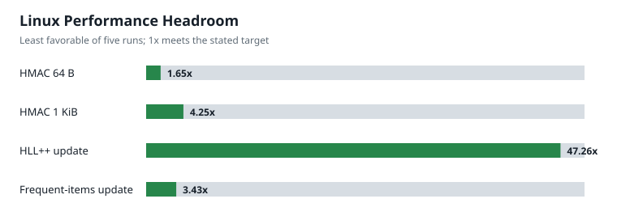
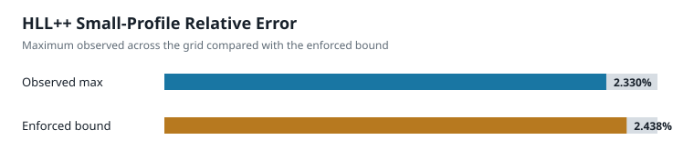
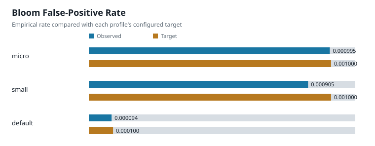
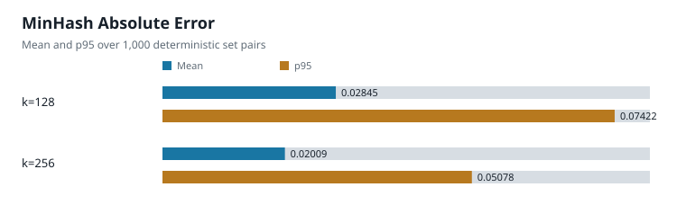

# Evidence Scorecard

This page summarizes the checked-in performance and accuracy evidence. It is a
navigation layer, not a substitute for the complete methods and raw samples in
[Benchmark Results](benchmarks.md), [Characterization
Results](characterization.md), and the [DataSketches Oracle
Comparison](datasketches_oracle.md).

The current Linux benchmark measured commit
`cf9de450fc96a8fa6b2204be2875d9b2a79c085a`. Alpha.3 changes documentation,
packaging, and automation only; sketch code and semantics are unchanged from
that commit.

## Performance Headroom



Values use the least favorable of five serial Linux runs. For throughput paths,
the ratio is worst observed throughput divided by the minimum target. For
latency paths, it is maximum permitted latency divided by worst observed
latency. Values above 1x meet the target. Microbenchmarks are useful for
regression detection and relative capacity planning; they are not end-to-end
application throughput claims.

## HLL++ Error



The maximum is taken across the documented `small` profile cardinality grid and
10 deterministic seeds per cell. It is below the conservative three-sigma
relative-error bound. It is not a universal maximum over every possible input.

## Bloom False Positives



The trials used 200,000 negative queries for `micro` and `small`, and 1,000,000
for `default`. Every inserted hash was also checked, with zero false negatives.
Observed rates vary statistically between trials.

## MinHash Error



Each row summarizes 1,000 deterministic set pairs. Increasing the signature
from 128 to 256 entries reduced mean and p95 absolute error as expected; these
values describe this workload rather than every possible set distribution.

## Independent Frequent-Items Oracle

| Workload | Sketchkit top-20 recall | DataSketches top-20 recall | NFP valid in both |
|---|---:|---:|---|
| Zipf(1.1), weighted | 100% | 100% | yes |
| Tail churn, weighted | 100% | 100% | yes |

The comparison checks query guarantees, not byte identity or equal error
magnitudes. See [why DataSketches is an oracle rather than a runtime
backend](../docs/DATASKETCHES.md).

## Reproduce

```sh
GOMAXPROCS=1 go test ./bench/hash -run '^$' -bench='BenchmarkHMACSHA25664_(64B|1KB)$' -benchmem -count=5
GOMAXPROCS=1 go test ./bench/sketch -run '^$' -bench='Benchmark(HLLPPAddHash|FrequentItemsAddHash)_' -benchmem -count=5
python -m pip install -e '.[oracle]'
python scripts/datasketches_oracle.py --check
python scripts/render_scorecard.py --check
```

The chart source values are in [`scorecard.json`](scorecard.json). Regenerate
the SVG files with `python scripts/render_scorecard.py`.
