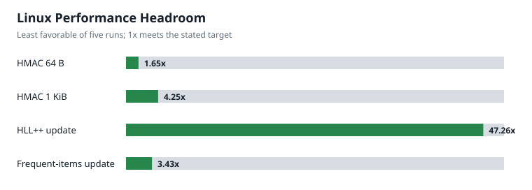
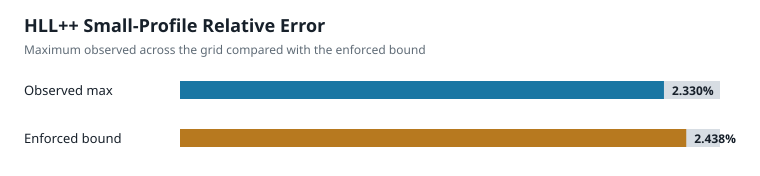
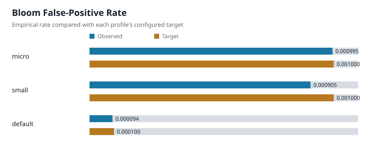
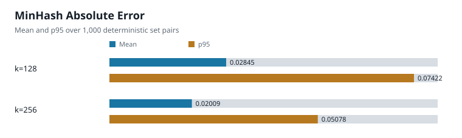

# Evidence Scorecard

The measured hash and update paths met their performance targets. HLL++ error
stayed inside the characterization threshold, and both weighted frequent-items
workloads retained the true top 20. The charts below summarize the results;
[benchmarks](benchmarks.md), [characterization](characterization.md), and the
[oracle comparison](datasketches_oracle.md) contain methods and raw samples.

The August 2026 Linux benchmark measured commit
`cf9de450fc96a8fa6b2204be2875d9b2a79c085a`. These are historical measurements;
the linked records identify the code and environment tested.

## Performance Headroom



Values use the least favorable of five serial Linux runs. For throughput paths,
the ratio is worst observed throughput divided by the minimum target. For
latency paths, it is maximum permitted latency divided by worst observed
latency. Values above 1x meet the target.

## HLL++ Error



The maximum is taken across the documented `small` profile cardinality grid and
10 deterministic seeds per cell. It is below the conservative three-sigma
relative-error threshold used by the characterization checks.

## Bloom False Positives



The trials used 200,000 negative queries for `micro` and `small`, and 1,000,000
for `default`. Every inserted hash was also checked, with zero false negatives.
Observed rates vary statistically between trials.

## MinHash Error



Each row summarizes 1,000 deterministic set pairs. Increasing the signature
from 128 to 256 entries reduced mean and p95 absolute error on these pairs.

## Independent Frequent-Items Oracle

| Workload | Sketchkit top-20 recall | DataSketches top-20 recall | NFP valid in both |
|---|---:|---:|---|
| Zipf(1.1), weighted | 100% | 100% | yes |
| Tail churn, weighted | 100% | 100% | yes |

See [the independent comparison](../docs/DATASKETCHES.md) for query guarantees,
implementation differences, and scope.

## Measurement Scope

Each benchmark series describes one machine and workload. Microbenchmarks measure
isolated paths, not application throughput. HLL++, Bloom, and MinHash error varies
statistically; observed errors are not universal bounds on future inputs. The
frequent-items intervals are deterministic. The linked reports preserve the exact
versions, seeds, and methods so you can rerun them for your deployment.

## Reproduce

```sh
GOMAXPROCS=1 go test ./bench/hash -run '^$' -bench='BenchmarkHMACSHA25664_(64B|1KB)$' -benchmem -count=5
GOMAXPROCS=1 go test ./bench/sketch -run '^$' -bench='Benchmark(HLLPPAddHash|FrequentItemsAddHash)_' -benchmem -count=5
python -m pip install -e '.[oracle]'
python scripts/datasketches_oracle.py --check
python scripts/render_scorecard.py --check
```

The chart source values are in [`scorecard.json`](scorecard.json). Regenerate
the SVG files with `python scripts/render_scorecard.py`.
